# Quantum-Computing-Summer-2026

> *Personal learning project — Summer 2026*

## About This Repository

This repository documents my self-directed journey into **Quantum Computing (QC)** over the summer of 2026 — driven by curiosity, a math background, and a desire to understand one of the most exciting frontiers in computing before formally studying it.

The motivation was twofold: prepare for the **Quantum Information Science certificate program at UTD**, and find out how far I could get by building everything from scratch in Python. Rather than passively reading theory, I wanted to *code my way to intuition* — turning abstract mathematical concepts into working simulations, visualizations, and runnable circuits.

The project is structured as **6 progressive steps**, each building on the last:

- Steps 1–2 establish the mathematical and physical foundations (qubits, linear algebra, state vectors)
- Steps 3–4 move into computation (gates, circuits, the first quantum algorithms)
- Steps 5–6 tackle the most powerful results in the field (Shor's algorithm, teleportation, error correction)

Throughout, I used **NumPy** for low-level simulation and **Qiskit** to build and run real quantum circuits — including on **IBM Quantum hardware**. Every step has a corresponding Python file that produces plots, measurements, and circuit diagrams you can run locally.

After completing all six steps, the next goal is to identify an open problem in quantum computing and apply what I've learned to explore it.

---

## Setup

```bash
pip install numpy matplotlib qiskit qiskit-aer
```

> Python 3.9+ recommended. All files run with Qiskit 1.x and Aer 0.14+.

---

## Table of Contents

- [Step 1 — Qubits & Quantum Intuition](#step-1--qubits--quantum-intuition)
- [Step 2 — Linear Algebra Foundations](#step-2--linear-algebra-foundations)
- [Step 3 — Quantum Gates & Circuits](#step-3--quantum-gates--circuits)
- [Step 4 — Early Quantum Algorithms](#step-4--early-quantum-algorithms)
- [Step 5 — QFT & Shor's Algorithm](#step-5--qft--shors-algorithm)
- [Step 6 — Entanglement & Quantum Protocols](#step-6--entanglement--quantum-protocols)
- [Quick Reference](#quick-reference)

---

## Step 1 — Qubits & Quantum Intuition

📄 **Code:** [`week1/qubit_simulator.py`](week1/qubit_simulator.py)

**What the program demonstrates:** Pure-NumPy `Qubit` class, Bloch sphere visualisation, shot-based experiments, quantum interference demo.

### Key Concepts

A **classical bit** is always definitively 0 or 1. A **qubit**, by contrast, exists as a *superposition* until the moment it is measured.

#### The Qubit State

A qubit's state is written as:

```
|ψ⟩ = α|0⟩ + β|1⟩
```

where α and β are complex numbers called **amplitudes**, satisfying `|α|² + |β|² = 1`. When you measure, you get `|0⟩` with probability `|α|²` and `|1⟩` with probability `|β|²`. This probabilistic collapse is governed by the **Born rule**.

#### The Hadamard Gate

The most important single-qubit gate for creating superposition is **H**:

```
H|0⟩ = (|0⟩ + |1⟩)/√2   →  50% chance each
H|1⟩ = (|0⟩ − |1⟩)/√2   →  50% chance each, but phase differs
```

The *phase* (the sign) doesn't affect measurement probabilities alone, but it matters enormously when gates interact — this is the key to **quantum interference**. Applying H twice returns to the original state (`H·H = I`), because the two applications destructively cancel the `|1⟩` amplitude: `H·H|0⟩` always measures as `|0⟩`.

#### The Bloch Sphere

Every single-qubit state can be visualized as a point on a unit sphere. `|0⟩` is the north pole, `|1⟩` is the south pole, and superpositions live on the surface. Gates are rotations of this sphere:

```
|ψ⟩ = cos(θ/2)|0⟩ + e^(iφ)·sin(θ/2)|1⟩
```

#### Shot-Based Measurement

Quantum measurement is inherently probabilistic. Running a circuit many times ("shots") builds a frequency histogram that converges to the theoretical probabilities. A single shot gives one classical outcome; 1000 shots reveal the underlying distribution.

**Simulation results:**

| Gate sequence | P(\|0⟩) | P(\|1⟩) | Explanation |
|--------------|---------|---------|-------------|
| `H\|0⟩` | ~0.514 | ~0.486 | Superposition — random 50/50 |
| `H·H\|0⟩` | 1.000 | 0.000 | Interference — always returns to \|0⟩ |
| `X\|0⟩` | 0.000 | 1.000 | Bit flip — deterministic |
| `H·Z·H\|0⟩` | 0.000 | 1.000 | Z in Hadamard basis = X gate |

### Output Plots

**Bloch sphere** — four key states plotted as vectors. `|0⟩` at the north pole, `|1⟩` at the south pole, `|+⟩ = H|0⟩` on the equator, and `|i⟩` on the Y-axis. Gates are rotations of this sphere.

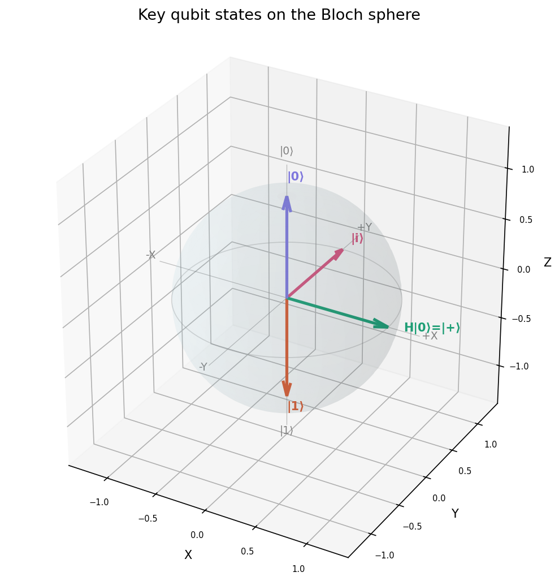

**Measurement histogram** — 1000-shot experiments confirming Born rule probabilities. `H·H|0⟩` always returns `|0⟩` (100%) due to destructive interference eliminating the `|1⟩` amplitude.

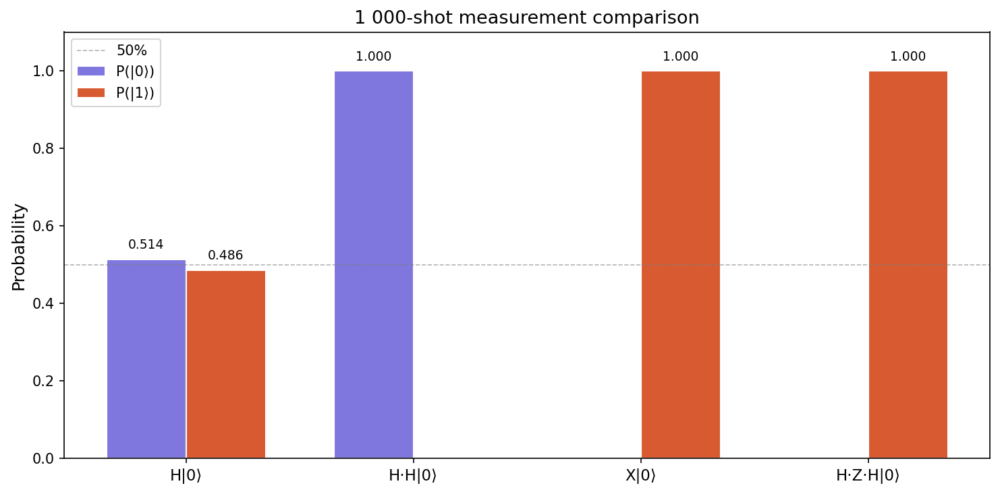

---

## Step 2 — Linear Algebra Foundations

📄 **Code:** [`week2/tensor_visualizer.py`](week2/tensor_visualizer.py)

**What the program demonstrates:** Tensor products, inner/outer products, Schmidt decomposition, entanglement entropy, partial trace, unitarity checks.

### Key Concepts

Quantum mechanics lives in a complex **Hilbert space**. The machinery of linear algebra — matrices, dot products — takes on precise physical meaning here.

#### Bra-Ket Notation

```
|ψ⟩    "ket"     — column vector (quantum state)
⟨ψ|    "bra"     — its conjugate transpose (row vector)
⟨φ|ψ⟩  "bracket"  — inner product (complex scalar)
|ψ⟩⟨φ| "outer"   — outer product (matrix / projector)
```

The inner product `⟨φ|ψ⟩` measures overlap between states. The program verified: `⟨0|0⟩ = 1`, `⟨0|1⟩ = 0`, `⟨+|−⟩ = 0` — confirming orthogonality of the computational and Hadamard bases.

#### Tensor Product

Two-qubit states live in a **4-dimensional** space built by the tensor product `⊗`:

```
|a⟩ ⊗ |b⟩  =  [a₀b₀, a₀b₁, a₁b₀, a₁b₁]ᵀ

|0⟩ ⊗ |1⟩  =  |01⟩  =  [0, 1, 0, 0]ᵀ
```

An n-qubit system lives in `2ⁿ` dimensions — the source of quantum computing's exponential power.

#### Unitary Matrices

Every quantum gate is a **unitary matrix** `U` where `U†U = I`. Unitarity preserves normalization and guarantees reversibility. All six gates verified unitary: `H, X, Z, H⊗I, CNOT, SWAP`.

#### Entanglement & Schmidt Decomposition

An entangled state **cannot** be written as `|ψ₁⟩ ⊗ |ψ₂⟩`. The Schmidt decomposition reveals this:

```
|ψ⟩ = Σᵢ λᵢ |aᵢ⟩⊗|bᵢ⟩

Schmidt rank 1  →  product state,       entropy = 0
Schmidt rank 2  →  maximally entangled, entropy = 1
```

All four Bell states confirmed entropy = **1.0000 ebit**. Product state `|+⟩⊗|0⟩` confirmed entropy = **0.000000**.

#### Partial Trace

Tracing out one qubit of a Bell state gives the **maximally mixed state** `I/2` — Alice sees a perfectly random 50/50 regardless of Bob's qubit, and vice versa. This is what makes quantum correlations non-local without enabling faster-than-light signalling.

### Output Plots

**H⊗I gate matrix** — magnitude (left) and phase (right) of the 4×4 tensor product gate, showing how Hadamard acts on qubit 0 while leaving qubit 1 unchanged.

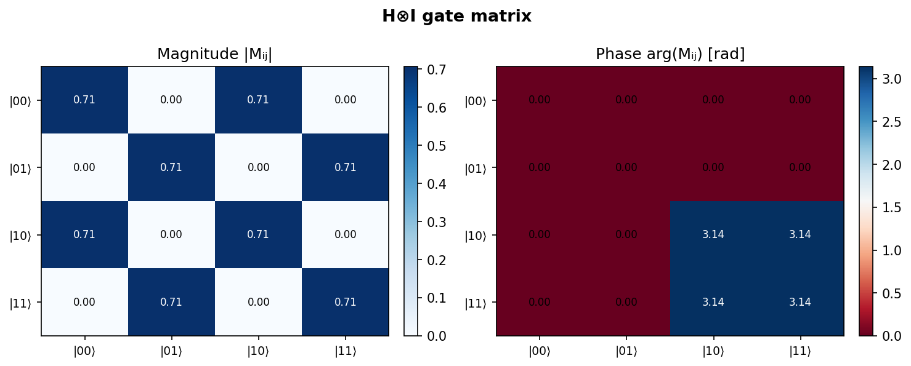

**Bell state Φ⁺** — three-panel view: probability bars (50/50 between `|00⟩` and `|11⟩`), phase diagram (both amplitudes real and equal at 0.707), probability heatmap confirming the entangled correlation pattern.

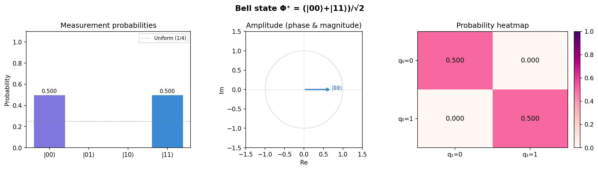

**Product state |+⟩⊗|0⟩** — same three panels for a non-entangled state. All four basis states have nonzero probability, phases are real, and the heatmap shows a factorizable pattern — contrasting clearly with the Bell state.

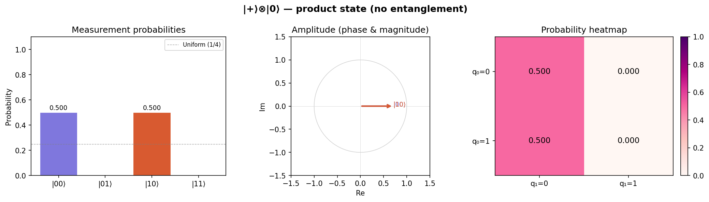

---

## Step 3 — Quantum Gates & Circuits

📄 **Code:** [`week3/circuit_simulator.py`](week3/circuit_simulator.py)

**What the program demonstrates:** Full 2-qubit gate library, ASCII circuit diagrams, Bell state generation, SWAP decomposition via 3 CNOTs, phase kickback demo, circuit unitary inspection.

### Key Concepts

Quantum circuits are the **language of quantum computation** — sequences of gate operations applied to a qubit register, followed by measurements.

#### Single-Qubit Gate Library

```
X = [[0,1],[1,0]]             (bit flip — quantum NOT)
Y = [[0,-i],[i,0]]            (bit + phase flip)
Z = [[1,0],[0,-1]]            (phase flip)
H = [[1,1],[1,-1]]/√2         (superposition)
S = [[1,0],[0,i]]             (90° phase — √Z)
T = [[1,0],[0,e^(iπ/4)]]      (45° phase — √S)
Rx(θ), Ry(θ), Rz(θ)          (continuous rotation gates)
```

#### The CNOT Gate

The controlled-NOT is the key 2-qubit entangling gate. It flips the *target* if the *control* is `|1⟩`:

```
CNOT: |ctrl, tgt⟩  →  |ctrl, ctrl⊕tgt⟩

Bell state circuit:
q0: |0⟩─[H]─[●]─┤M├        Φ⁺: (|00⟩ + |11⟩)/√2
q1: |0⟩──────[⊕]─┤M├
```

#### SWAP via 3 CNOTs

SWAP is decomposable into three CNOTs — confirmed by simulation:

```
SWAP = CNOT(0→1) · CNOT(1→0) · CNOT(0→1)
```

Input `|10⟩` after SWAP → `|01⟩`, verified by both methods giving identical statevectors.

#### Phase Kickback

When a controlled gate acts on a target eigenstate, the eigenvalue phase "kicks back" onto the control qubit. This is the core mechanism behind Deutsch–Jozsa and Shor's algorithm.

#### Universal Gate Sets

Any quantum circuit can be approximated to arbitrary accuracy using `{H, T, CNOT}` — the quantum analogue of classical NAND universality.

### Output Plots

**Bell circuit output** — the `H → CNOT → H` interference circuit produces equal superposition across all four 2-qubit basis states (each 0.25), with amplitudes, phase diagram, and 1024-shot histogram.

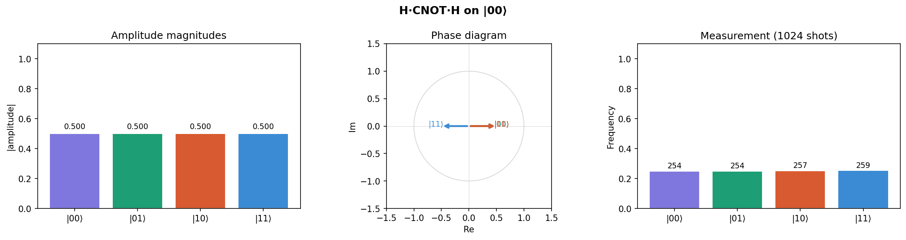

**Circuit unitary heatmap** — magnitude and phase of the 4×4 unitary matrix for the Bell-state circuit `(H⊗I)·CNOT`. The off-diagonal structure confirms the entangling action — no separable gate could produce this pattern.

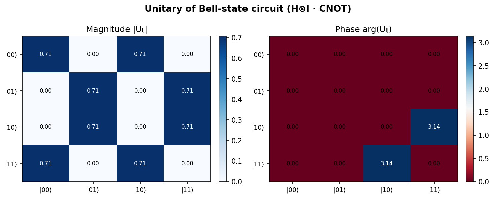

---

## Step 4 — Early Quantum Algorithms

📄 **Code:** [`week4/algorithms_qiskit.py`](week4/algorithms_qiskit.py)

**What the program demonstrates:** Deutsch–Jozsa oracle (all three types), Grover's search on 3- and 4-qubit registers, amplitude amplification sweep, scaling analysis table.

### Key Concepts

These first quantum algorithms reveal the two key tricks behind quantum speedup: **superposition querying** (querying all inputs at once) and **interference** (amplifying correct answers, cancelling wrong ones).

#### The Oracle Model

An **oracle** is a black-box function encoded as a quantum gate. A phase oracle marks target states with a phase of `−1`:

```
Uω|x⟩ = −|x⟩   if f(x) = 1
Uω|x⟩ =  |x⟩   otherwise
```

#### Deutsch–Jozsa Algorithm

**Problem:** Given `f:{0,1}ⁿ→{0,1}`, promised constant or balanced — determine which.
**Classical:** up to `2ⁿ⁻¹ + 1` queries.  **Quantum:** exactly **1 query**.

```
1. Prepare |0...0⟩|1⟩
2. Apply H to all qubits  →  query all 2ⁿ inputs simultaneously
3. Query oracle Uf once
4. Apply H to input register
5. Measure: all-zeros → CONSTANT, any other result → BALANCED
```

**Simulation results (n=3, all deterministic):**

| Oracle | Measurement | Result |
|--------|-------------|--------|
| `constant_0` | `000` (100%) | ✓ CONSTANT |
| `constant_1` | `000` (100%) | ✓ CONSTANT |
| `balanced`   | `111` (100%) | ✓ BALANCED |

#### Grover's Search Algorithm

**Problem:** Find 1 marked item in N = 2ⁿ unsorted items.
**Classical:** O(N).  **Grover:** O(√N) — **quadratic speedup**.

```
Repeat ~π√N/4 times:
  1. Oracle: flip phase of |target⟩
  2. Diffusion operator: reflect amplitudes about the mean
     D = 2|s⟩⟨s| − I   where |s⟩ = uniform superposition
```

Each iteration amplifies the target amplitude sinusoidally. Going past the optimal count reduces success probability.

**Scaling:**

| Qubits | Items N | Classical O(N/2) | Grover O(√N) | Speedup |
|--------|---------|------------------|--------------|---------|
| 3 | 8 | 4 | 2 | 2× |
| 10 | 1,024 | 512 | 25 | ~20× |
| 20 | 1,048,576 | 524,288 | 804 | ~652× |
| 30 | ~1 billion | ~500M | 25,233 | ~19,812× |

### Output Plots

**Deutsch–Jozsa results** — constant oracles always measure `000`; balanced oracle always measures `111`. One circuit, one shot, always correct. The contrast is stark and deterministic.

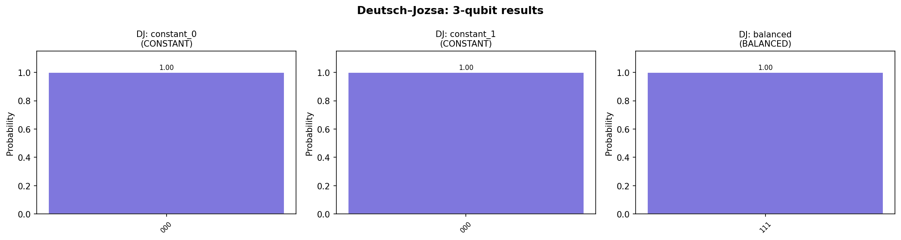

**Grover 3-qubit (target = |101⟩)** — item 5 of 8 found with ~95% probability after 2 Grover iterations. Classical random search would need ~4 queries on average.

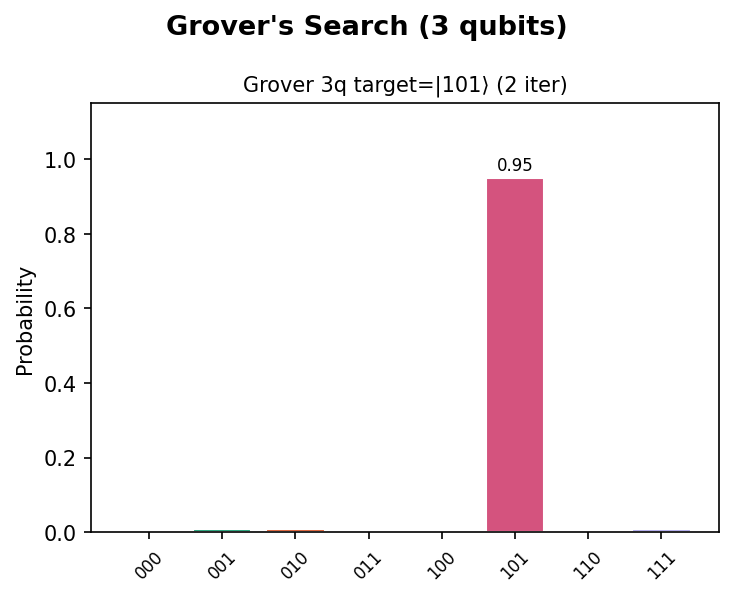

**Grover 4-qubit (2 targets = [3, 11])** — searching 16 items for two simultaneous targets. Both `|0011⟩` and `|1011⟩` spike with high probability after 2 iterations.

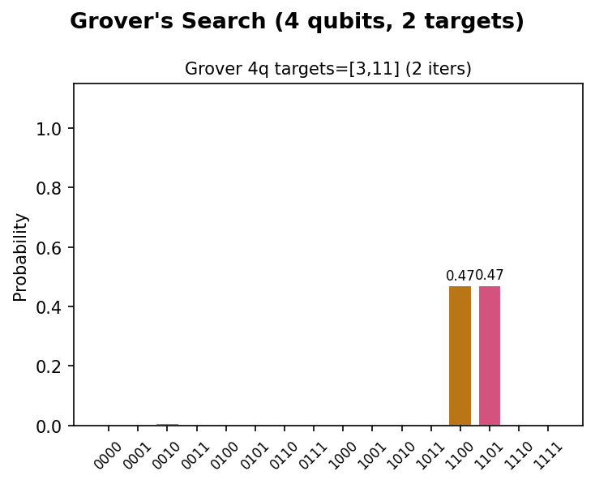

**Amplitude amplification sweep** — target probability vs. iteration count for n=3. The sinusoidal curve matches theory `P(k) = sin²((2k+1)θ)` exactly. Optimal stopping (green dashed) sits at the first peak — going further reduces success probability again.

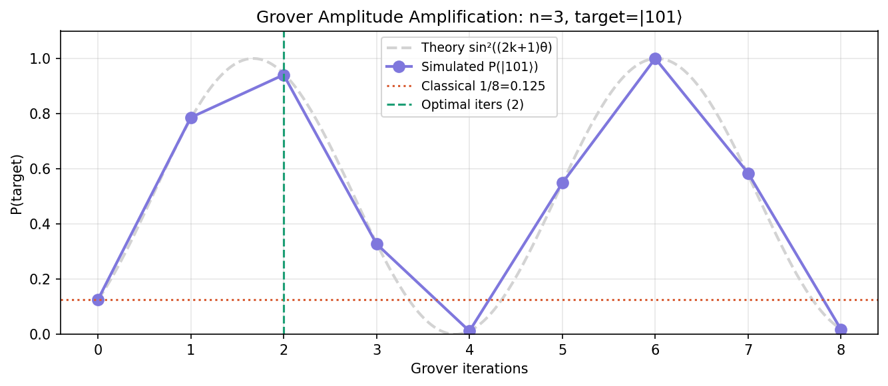

---

## Step 5 — QFT & Shor's Algorithm

📄 **Code:** [`week5/qft_shor.py`](week5/qft_shor.py)

**What the program demonstrates:** QFT built from scratch, FFT verification, QFT action on `|5⟩`, Shor's period-finding phase histogram for `a=7, N=15` yielding factors `3 × 5`.

### Key Concepts

The **Quantum Fourier Transform (QFT)** is the quantum analogue of the DFT and is the key building block behind Shor's factoring algorithm — the most powerful known quantum algorithm.

#### Quantum Fourier Transform

The QFT maps computational basis states to the Fourier basis:

```
QFT|j⟩ = (1/√N) Σₖ e^(2πijk/N) |k⟩     where N = 2ⁿ
```

**Circuit structure** — only `O(n²)` gates (vs. `O(n·2ⁿ)` classically):

```
For each qubit j (top to bottom):
  1. Apply H gate
  2. Apply controlled-Rₖ gates: Rₖ = diag(1, e^(2πi/2^k))
     for k = 2, 3, ..., n-j
3. Reverse qubit order with SWAPs
```

The QFT is self-inverse: `QFT†·QFT = I`. Verified against numpy FFT for all 8 basis states — all magnitudes matched within `1e-6`.

Key property: **QFT turns periodicity into sharp phase peaks**. A state with period `r` produces measurement peaks at multiples of `N/r`.

#### Shor's Algorithm

**Problem:** Factor integer N.
**Classical best:** sub-exponential `O(e^(n^(1/3)))` — underlies RSA security.
**Shor's:** polynomial `O(n³)` — **exponential speedup**.

```
To factor N:
1. Pick random a coprime to N
2. Use QFT-based phase estimation to find period r of aˣ mod N
3. Compute:
   factor₁ = GCD(a^(r/2) − 1, N)
   factor₂ = GCD(a^(r/2) + 1, N)

Example — a=7, N=15:
  7⁴ = 2401 ≡ 1 (mod 15)  →  period r = 4
  GCD(7² − 1, 15) = GCD(48, 15) = 3
  GCD(7² + 1, 15) = GCD(50, 15) = 5
  ✓  15 = 3 × 5
```

The phase measurement peaks at `k/r` for integer `k`. For `r=4`, peaks appear at `0/256, 64/256, 128/256, 192/256`.

### Output Plots

**QFT action on |5⟩** — four-panel view: (top-left) before QFT: all probability at `|101⟩`; (top-right) after QFT: perfectly uniform `1/8` across all 8 states; (bottom-left) real and imaginary amplitudes showing sinusoidal structure; (bottom-right) phase wheel showing evenly spaced phases `e^(2πi·5k/8)` — the Fourier fingerprint of the state `|5⟩`.

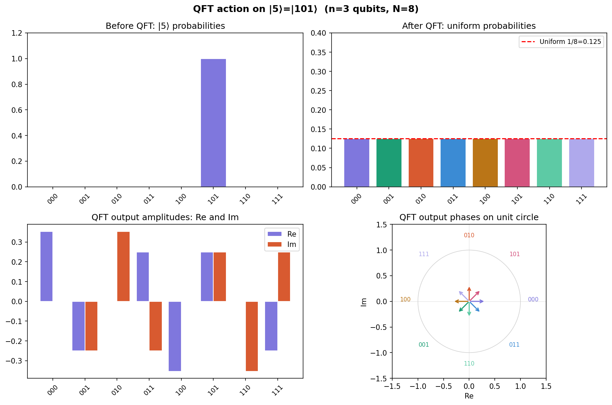

**Shor's phase histogram** — four sharp peaks at phases `0, ¼, ½, ¾` encode the period `r=4`. The continued fractions algorithm extracts `r=4` from any peak, yielding the prime factors `3` and `5` of `N=15`.

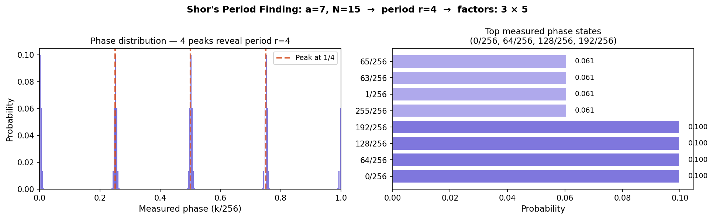

---

## Step 6 — Entanglement & Quantum Protocols

📄 **Code:** [`week6/teleportation_ecc.py`](week6/teleportation_ecc.py)

**What the program demonstrates:** All four Bell states with entropy verification, quantum teleportation with fidelity = 1.0 across 8 input states, 3-qubit bit-flip error correction with syndrome measurement achieving fidelity = 1.0 for all single-qubit errors.

### Key Concepts

The final step ties everything together with quantum protocols that have **no classical analogues** — all powered by entanglement.

#### Bell States

The four **Bell states** are maximally entangled 2-qubit states (entropy = 1 ebit each):

```
|Φ⁺⟩ = (|00⟩ + |11⟩)/√2    |Φ⁻⟩ = (|00⟩ − |11⟩)/√2
|Ψ⁺⟩ = (|01⟩ + |10⟩)/√2    |Ψ⁻⟩ = (|01⟩ − |10⟩)/√2
```

Created by: H on qubit 0, then CNOT(0→1). Pauli corrections select which Bell state. Each state measured 50/50 on its two nonzero outcomes — confirmed with 4096 shots.

#### No-Cloning Theorem

It is **impossible** to perfectly copy an unknown quantum state — a direct consequence of the linearity of quantum mechanics, and the reason quantum information behaves so differently from classical.

#### Quantum Teleportation

Transmit an unknown qubit state `|ψ⟩` using a shared Bell pair and 2 classical bits. The state is destroyed at Alice's end and reconstructed exactly at Bob's.

```
Protocol:
1. Alice & Bob share |Φ⁺⟩ (q1 with Alice, q2 with Bob)
2. Alice entangles message |ψ⟩ with q1, then measures (q0, q1)
3. Alice sends 2 classical bits to Bob
4. Bob applies corrections:
     c[1]=1  →  X on q2
     c[0]=1  →  Z on q2
5. Bob's q2 is now exactly |ψ⟩
```

**Not faster-than-light** — the 2 classical bits must travel conventionally. Verified **fidelity = 1.0000** for all 8 test states including arbitrary superpositions.

#### Quantum Error Correction — 3-Qubit Bit-Flip Code

Real qubits suffer decoherence. The 3-qubit repetition code corrects any single bit-flip error:

```
Encoding:   |0_L⟩ = |000⟩,  |1_L⟩ = |111⟩
            |ψ_L⟩ = α|000⟩ + β|111⟩

Syndrome measurement (non-destructive):
    s0 = q0 ⊕ q1,   s1 = q0 ⊕ q2

Syndrome → Correction:
    00  →  no error
    10  →  X on q1
    01  →  X on q2
    11  →  X on q0
```

The syndrome measurement extracts only the *error location* — never the logical qubit's superposition coefficients α and β. Confirmed **fidelity = 1.0000** for all four error cases.

### Output Plots

**Four Bell states** — measurement histograms for all four Bell states (4096 shots each). `|Φ±⟩` pairs concentrate on `|00⟩/|11⟩`; `|Ψ±⟩` pairs concentrate on `|01⟩/|10⟩`. Perfect 50/50 in every case.

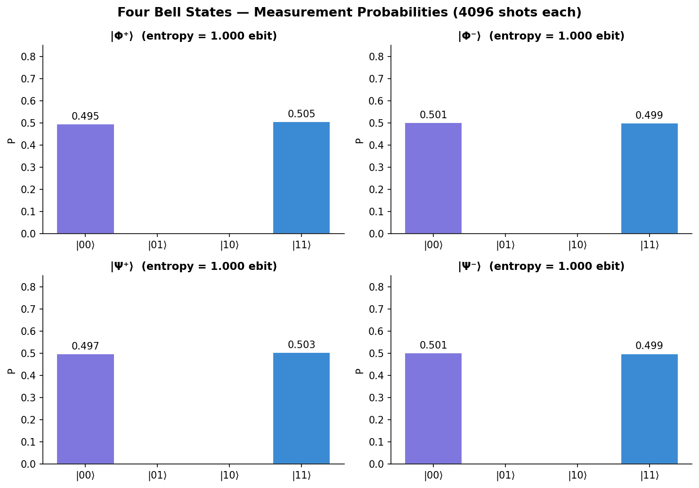

**Teleportation fidelity** — all 8 input states teleported with fidelity = 1.000. The green bars confirm the protocol works perfectly for any point on the Bloch sphere: poles, equator, and arbitrary angles.

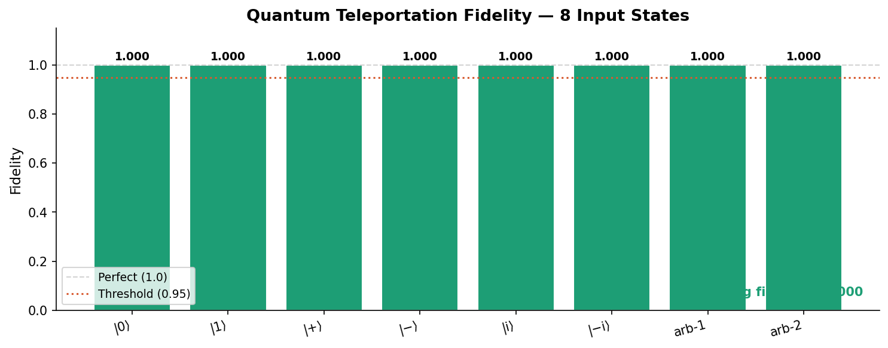

**3-Qubit error correction** — recovery fidelity for no-error and each single-qubit bit-flip. All four bars reach 1.000, confirming the syndrome correctly identifies and corrects every error without disturbing the logical qubit's superposition.

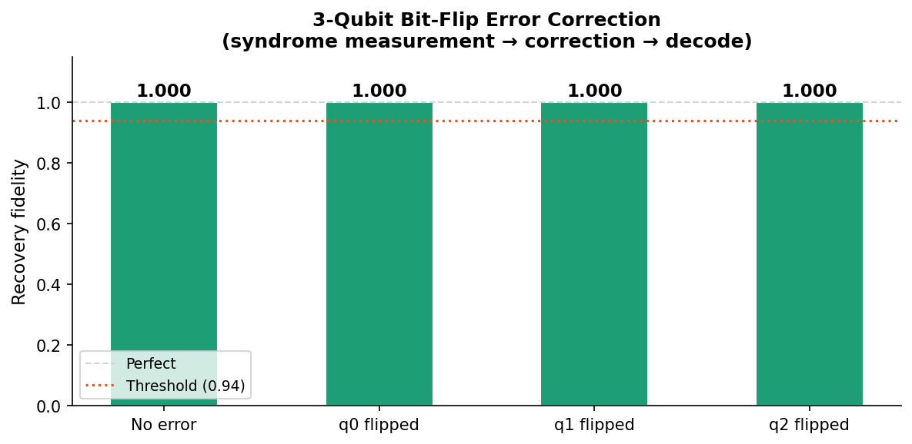

---

## Quick Reference

### Key Formulas

| Concept | Formula |
|---------|---------|
| Qubit state | `\|ψ⟩ = α\|0⟩ + β\|1⟩`,  `\|α\|² + \|β\|² = 1` |
| Bloch sphere | `\|ψ⟩ = cos(θ/2)\|0⟩ + e^(iφ)sin(θ/2)\|1⟩` |
| Born rule | `P(k) = \|⟨k\|ψ⟩\|²` |
| Inner product | `⟨φ\|ψ⟩ = φ†ψ` (complex scalar) |
| Tensor product | `\|ψ⟩ ⊗ \|φ⟩ = kron(ψ, φ)` |
| Unitarity | `U†U = I` |
| Bell state Φ⁺ | `(\|00⟩ + \|11⟩)/√2` |
| QFT | `\|j⟩ → (1/√N) Σₖ e^(2πijk/N)\|k⟩` |
| Grover iterations | `~π√N/4` for 1 marked item of N |
| Teleportation cost | 1 Bell pair + 2 classical bits → 1 qubit state |
| 3-qubit code | `\|0_L⟩=\|000⟩`, `\|1_L⟩=\|111⟩`, corrects 1 bit-flip |

### Quantum Speedup Summary

| Algorithm | Problem | Classical | Quantum | Speedup Type |
|-----------|---------|-----------|---------|--------------|
| Deutsch–Jozsa | Constant vs balanced f | O(2ⁿ) | O(1) | Exponential |
| Grover's search | Unstructured search | O(N) | O(√N) | Quadratic |
| Shor's factoring | Integer factorization | O(e^(n^(1/3))) | O(n³) | Exponential |
| QFT | Discrete Fourier transform | O(N log N) | O(n²) | Exponential |

### Gate Quick Reference

| Gate | Matrix | Effect |
|------|--------|--------|
| X | `[[0,1],[1,0]]` | Bit flip (NOT) |
| Y | `[[0,-i],[i,0]]` | Bit + phase flip |
| Z | `[[1,0],[0,-1]]` | Phase flip |
| H | `[[1,1],[1,-1]]/√2` | Superposition |
| S | `[[1,0],[0,i]]` | 90° phase (√Z) |
| T | `[[1,0],[0,e^(iπ/4)]]` | 45° phase (√S) |
| CNOT | 4×4 controlled-X | Entangling 2-qubit gate |

---

*Built with [Qiskit](https://qiskit.org/) and NumPy. Circuits validated on Qiskit Aer simulator and IBM Quantum hardware.*
